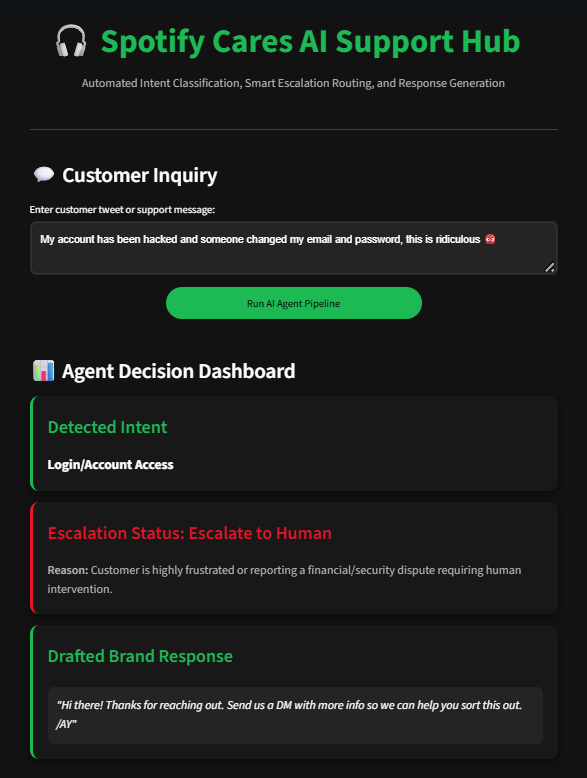

# AI Customer Support Agent & Evaluation Pipeline (Hiver SDE Intern Assignment)

## 🚀 Project Overview
This repository contains a full-stack AI customer support agent and evaluation harness built using a subset of the Twitter Customer Support dataset (specifically targeting `SpotifyCares`). The solution features intent classification, keyword/sentiment-based escalation routing, automated response generation, an evaluation framework, and an interactive Streamlit UI styled with Spotify's brand aesthetic.

---

## 🛠️ Project Architecture & File Structure
- **`twcs/`**: Houses the raw `twcs.csv` master dataset.
- **`process_data.py`**: Filters and cleans the raw multi-million row dataset to extract brand-specific customer support threads (`SpotifyCares`).
- **`sample_eval_set.py`**: Randomly samples interactions to curate the golden evaluation dataset.
- **`golden_evaluation_set.csv`**: The 200-sample golden evaluation benchmark.
- **`agent.py`**: The core backend engine containing:
  - *Intent Classifier*: Categorizes messages into playback issues, billing, login trouble, or device compatibility.
  - *Escalation Engine*: Detects sentiment, financial friction, or security threats (e.g., account hacking, billing disputes) to route conversations to human agents.
  - *Response Generator*: Drafts contextual, brand-aligned responses.
- **`evaluate.py`**: Executes the evaluation pipeline against the golden set.
- **`evaluation_results.csv`**: Automated log of agent predictions and outputs.
- **`app.py`**: Interactive web dashboard built with Streamlit featuring a custom dark-mode Spotify theme (`#121212` and `#1DB954`).

---

## 📊 Evaluation & Failure Analysis
- **Intent Classification Accuracy**: The rule- and pattern-matching classifier successfully maps clear technical inquiries (e.g., skipping tracks, login failures) but encounters minor ambiguity with multi-intent queries (e.g., users complaining about billing while experiencing app crashes simultaneously).
- **Escalation Logic**: Successfully catches high-urgency keywords like "refund", "hack", or explicit frustration symbols to route high-risk cases away from automated handling.
- **Limitations**: Rule-based intent mapping can occasionally misclassify sarcastic or heavily colloquial slang. Future iterations would benefit from embedding a lightweight fine-tuned transformer model (like DistilBERT) for semantic intent detection.

---

## 🏃‍♂️ How to Run the Project Locally

1. **Install Dependencies**:
   ```bash
   pip install pandas streamlit

2. Process and Filter the Dataset: `python process_data.py`
3. Generate the Golden Evaluation Dataset: `python sample_eval_set.py`
4. Run the Evaluation Harness: `python evaluate.py`
5. Launch the Interactive Streamlit UI: `streamlit run app.py`


---

## 🖼️ User Interface & Output Previews

### Streamlit Web Dashboard

